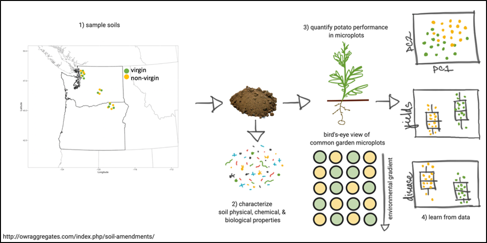
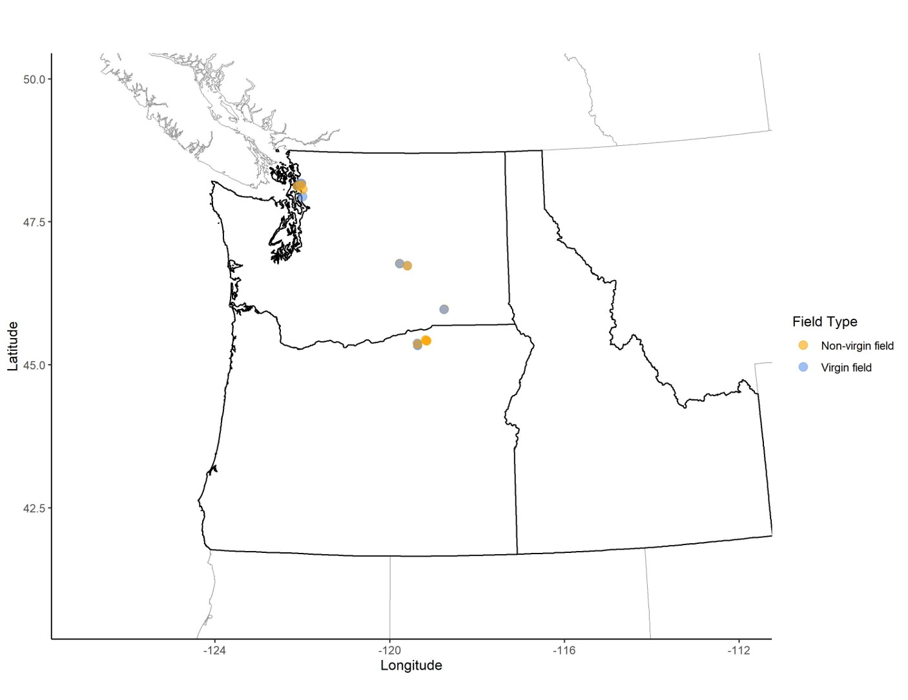
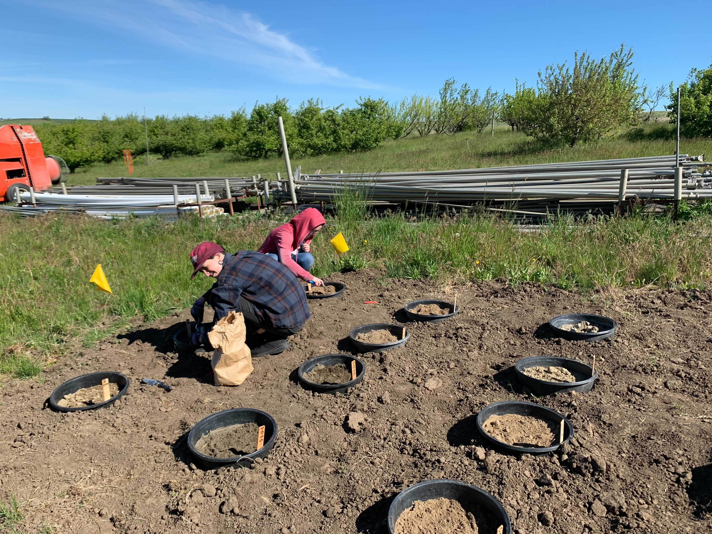
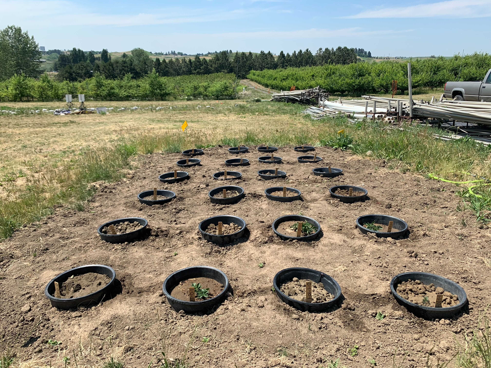
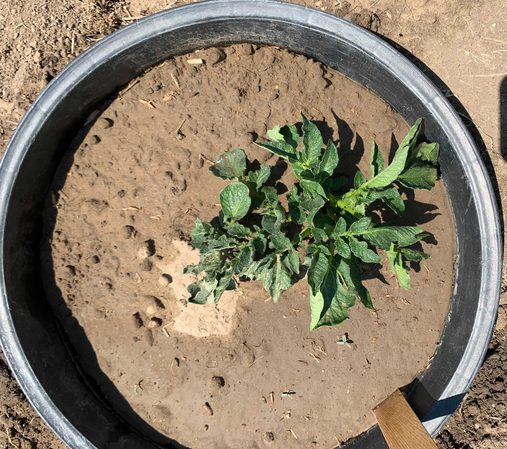
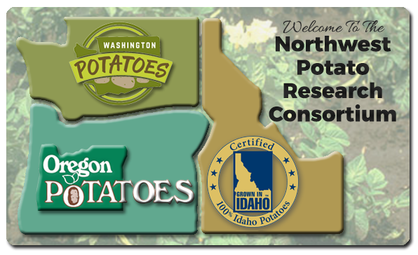

## Motivation
Since potatoes were first grown, growers have noticed that the history of a field influences both yield and quality. Fields previously planted with potatoes generally yield less than field soils not previously farmed (virgin soils) or fields never planted with potatoes. Indeed, recent conversations with growers indicated that 14-26% greater yields can be achieved from virgin soils compared to nearby non-virgin soils. The purpose of this project is to determine what is responsible for these observations.  

## Objectives 
1. Sample soils from virgin and non-virgin fields.
2. Characterize soil physical, chemical, and biological properties of virgin and non-virgin fields in Columbia and Skagit Valley.
3. Quantify potato performance and disease expression in microplots.
4. Learn from data.

## Study Design

  
  

  
## Research Activities
##### Soil sampling locations

##### Microplot
  

## Results

### PIs
- [David Linnard Wheeler](https://plantpath.wsu.edu/david-wheeler/)
- [Deirdre Griffin LaHue](https://css.wsu.edu/people/faculty/deirdre-griffin-lahue/)
- [Cynthia Gleason](https://plantpath.wsu.edu/people/faculty/gleason/)
- [Ken Frost](https://bpp.oregonstate.edu/users/kenneth-frost)

### Post-docs and Graduate Students
- Teal Potter
- Sudha GC Upadhaya

### Funding Source

  
  

