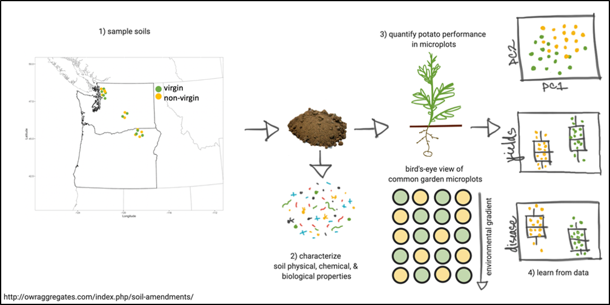

# Comparison of potato yields, soil health, and pathogen loads in virgin and non-virgin soils 
## Motivation
Since potatoes were first grown, growers have noticed that the history of a field influences both yield and quality. Fields previously planted with potatoes generally yield less than field soils not previously farmed (virgin soils) or fields never planted with potatoes. Indeed, recent conversations with growers indicated that 14-26% greater yields can be achieved from virgin soils compared to nearby non-virgin soils. The purpose of this project is to determine what is responsible for these observations.  
## Objectives 
1. Characterize soil physical, chemical, and biological properties of virgin and non-virgin fields in Columbia and Skagit Valley.
2. Quantify potato performance and disease expression in microplots.
3. Dissect the relationships between soil properties, potato yields, and disease expression 
## Material and methods

  
  

Soil samples will be collected from virgin and non-virgin soils (n=20) in Columbia Basin and Skagit Valley of Washington and Oregon.

Objective 1:

Objective 2:

Objective 3: 

## Funding Source

  
  

* Following soil properties will be characterized from each soil sample:
  * Soil physical, chemical and biological properties of soil
  * Free living and plant-parasitic nematodes with DNA sequencing
  * Presence and abundance of soilborne potato pathogen on semi-selective media
  * Bacterial and fungal community structure with 16S rRNA and ITS amplicon sequencing
* Potato yield and disease expression will be quantified in common garden microplots in Pullman, WA in 2021 and 2022.
* 
